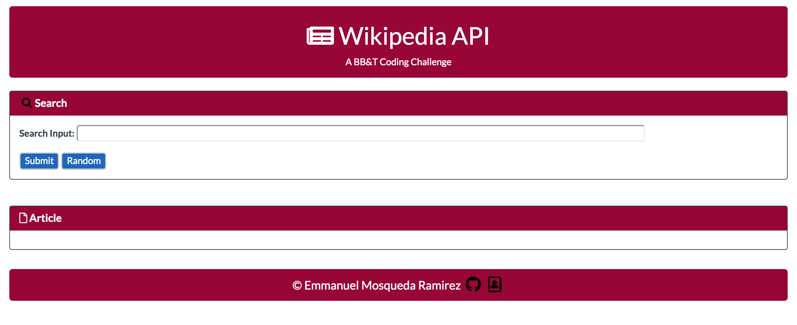

# Wikipedia API Client

A Wikipedia article viewer web application that allows a user to **research** and view **random** article extracts.

[Check it out live! ](https://emmamr.github.io/Wikipedia-API-Client/)
---

### How to use:

**Search**
One of the cool features of this app is that you can search whatever you'd like.
In the search input type what's on your mind and press Submit. Thanks to Wikipedia's restful JSON API, the app will return the first paragraph of the article for you to read and if you're you want to learn more you can press on the title and it will lead you to the main article.

**Random**
If you're in no rush and can't think of anything in perticular, try the random button. The random button will return random articles that will also provide the first paragraph and a link to the original article. 

**Additional Feature**
Mobile responsive

